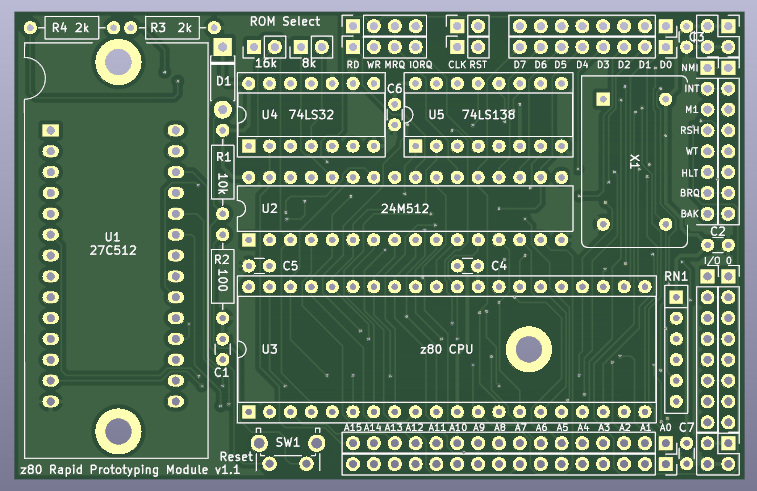
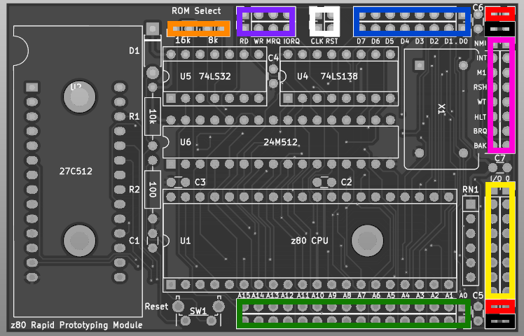
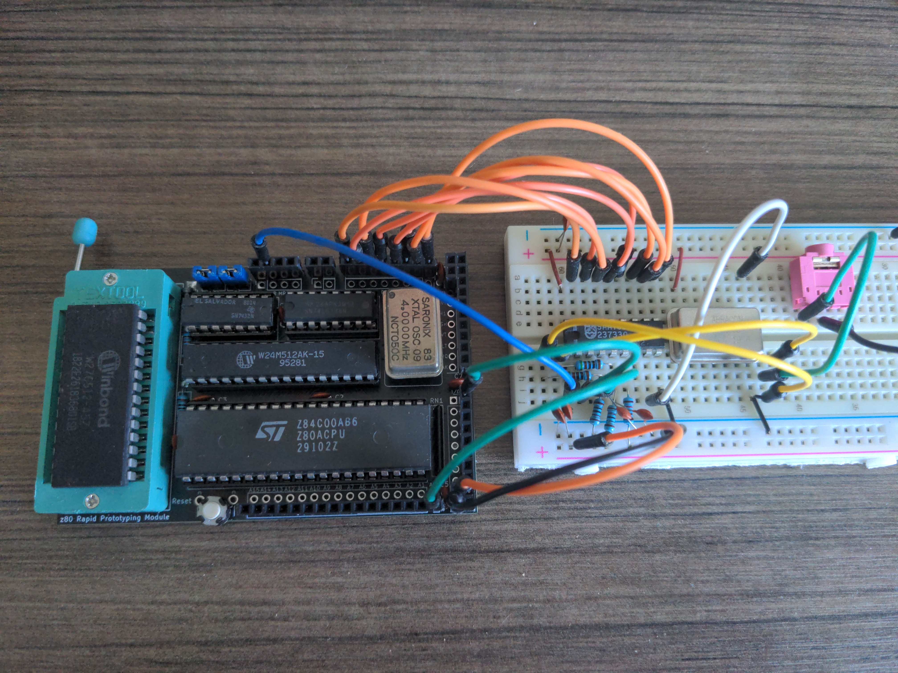
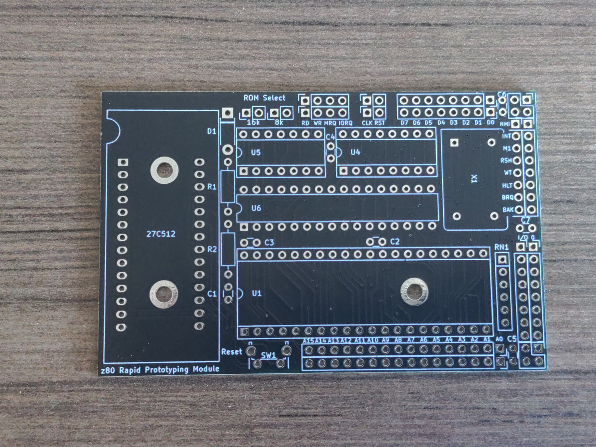
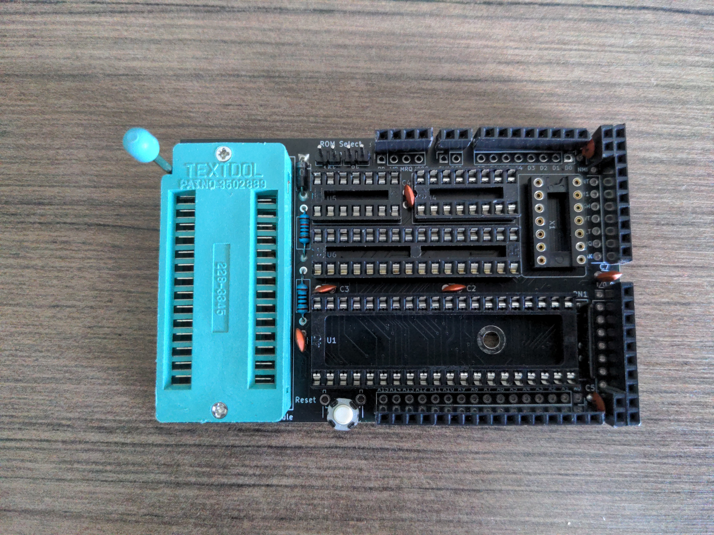

# The z80 Rapid Prototyping Module v1.1

---

---

The z80 RPM is a credit-card sized single board computer designed for prototyping hardware for the z80. With 8 built-in IO device select pins and every signal on the z80 available as a breakout, new hardware can quickly be tested and iterated upon, without the hassle of connecting the hardware to an existing z80 system. I wanted to create something of a 1980's Arduino: enough hardware to get a fully functional system, while keeping the footprint as small as possible and with all the signals exposed so I could hook up anything I want to it. I also designed the board around being able to add shields or hats for standalone z80 projects.

# Hardware Features

- 3 Memory Configurations (selectable via jumpers on board):
  
  - 56kb RAM and 8kb ROM (both 16k and 8k jumpers)
  
  - 48kb RAM and 16kb ROM (16k jumper)
  
  - 32kb RAM and 32kb ROM (no jumpers)

- 8 IO 'Chip Select' pins connected to bits A5-A7

- ZIF socket for easy ROM replacement

- Automatic reset on power up with manual reset button

- 90mm by 57mm footprint

- Entirety of the z80's pins are accessible and labeled via breakout

# Memory & IO Address Map

56k/8k memory configuration:

- ROM: 0x0000 - 0x1fff

- RAM: 0x2000 - 0xffff

48k/16k memory configuration:

- ROM: 0x0000 - 0x3fff

- RAM: 0x4000 - 0xffff

32k/32k memory configuration:

- ROM: 0x0000 - 0x7fff

- RAM: 0x8000 - 0xffff

IO map:

- 0b000xxxxx: IO device select 0

- 0b001xxxxx: IO device select 1

- 0b010xxxxx: IO device select 2

- 0b011xxxxx: IO device select 3

- 0b100xxxxx: IO device select 4

- 0b101xxxxx: IO device select 5

- 0b110xxxxx: IO device select 6

- 0b111xxxxx: IO device select 7

# Pinout

*Note this is the board layout from v1.0, however the pin locations have not changed*

Going clockwise starting from the top:

- Orange - Memory configuration jumpers

- Purple - Data signals

- White - Clock and reset

- Blue - Data bus

- Pink - z80 signals

- Yellow - IO device selects

- Green - Address bus

Some notes: Red and Black are +5v and GND respectively. Due to limited space on the board, the IO device select lines are not labeled. IO device 0 is at the top, device 1 is below device 0, etc, and device 7 is on the bottom, right above the lower +5v connection.

# Schematic

A PDF version is also available in the schematics folder.

# Bill of Materials

If you'd like to recreate this project, here are all the parts on the PCB. Other parts likely can be substituted in, but be sure to check with the datasheets to ensure they are actually compatible. As a side note, I socket all of my IC's, which allows the removal of the IC's from the board, but they are not absolutely necessary.

| Part Reference    | Value                  | Purpose                        |
| ----------------- | ---------------------- | ------------------------------ |
| C2,C3,C4,C5,C6,C7 | .1uF                   | Decoupling capacitors          |
| C1                | .1uF                   | Automatic reset circuit        |
| D1                | 1N40001                | Automatic reset circuit        |
| R1                | 10k                    | Automatic reset circuit        |
| R2                | 100                    | Automatic reset circuit        |
| R3,R4             | 2k                     | Memory configuration pulldowns |
| RN1               | 10k                    | z80 input pin pullups          |
| SW1               | Tactile switch         | Manual reset button            |
| U1                | 27C512 (ZIF 28 socket) | 64k EEPROM                     |
| U2                | 24M512                 | 64k SRAM                       |
| U3                | z80 CPU                | CPU                            |
| U4                | 74LS32                 | Memory configuration logic     |
| U5                | 74LS138                | IO device port decoder         |
| X1                | DIP 14 oscillator can  | CPU clock                      |

# Images

*Note all images are from v1.0*

Here's the RPM in action (I've got it hooked up to an SAA1099 here):

Build progress:

This project is open source and can be used for any purpose in compliance with the GPLv3, but comes with absolutely NO WARRANTY of any kind.

Thanks for checking out my project! If you find this project useful or interesting, I'd love to hear about it!
